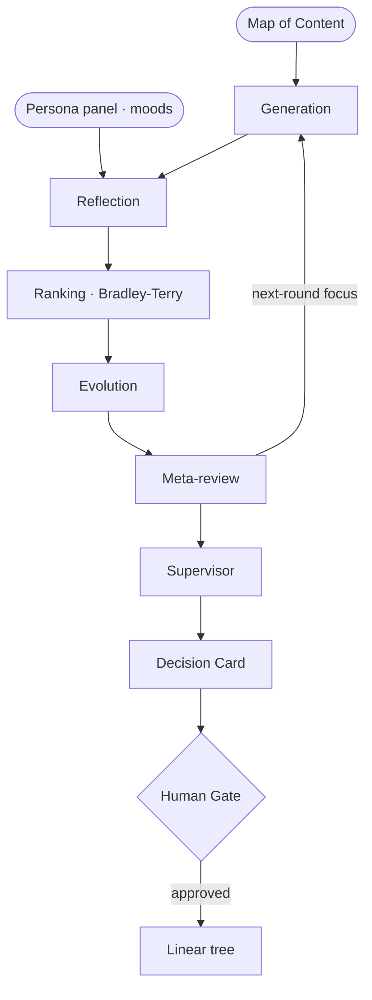

# Catfish — Cognitive Architecture

The generate→debate→evolve decision loop, distilled. Each stage has an **immutable identity** (its own `.md`, re-injected every round so it cannot drift). Edit the files to change the architecture.

## Loop

## Stage identities
- [[generation]] — Produce diverse candidate plans that differ on first-principle trade-offs, not phrasing, grounded only in the provided map of content and persona context
- [[reflection]] — Adversarially critique each candidate in parallel isolation; name the single most likely-wrong load-bearing assumption or omission
- [[ranking]] — In a pairwise comparison, pick the plan that better satisfies the decision's first principles
- [[evolution]] — Synthesize genuinely new candidates from the survivors — combine two that solve different concerns, simplify an over-engineered one, or import a pattern the meta-review surfaced
- [[meta-review]] — Distill recurring concerns and structural gaps across the round's critiques and matches into a one-line focus for the next round
- [[supervisor]] — Run the loop — track active candidates, scores, and round; prune the weakest; decide terminate-or-continue; hand finalists to the decision card

_Anti-drift is markdown, not magic: the same identity file is re-read each round._
