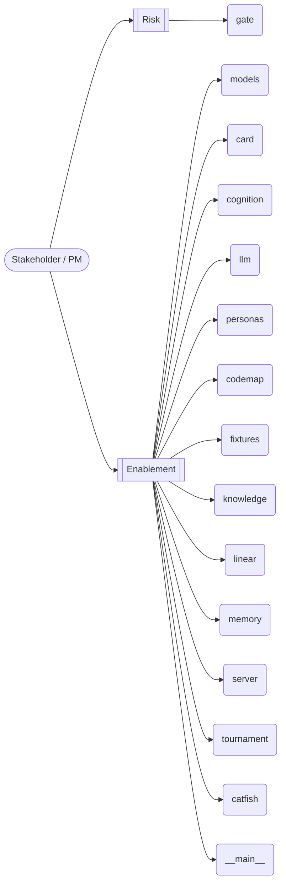

# Catfish — Business Capability Map

PM-facing view: what each capability is *for*, grouped by the kind of value it protects. Pairs with the engineer view in [[index]]. **Business-value lines are proposals — confirm them.**

## Value flow

## Capabilities by value

### Risk
- [[catfish-gate]] — (proposed) PreToolUse gate hook (Claude Code).

### Enablement
- [[catfish-models]] — (proposed) Shared data models for Catfish.
- [[catfish-card]] — (proposed) Decision cards: build from a tournament result, enforce terseness, render, gate.
- [[catfish-cognition]] — (proposed) The cognitive architecture, as plain markdown.
- [[catfish-llm]] — (proposed) Inference layer.
- [[catfish-personas]] — (proposed) Personas = reusable lenses. Each stamps a perspective-map: a filtered, typed view over the
- [[catfish-codemap]] — (proposed) Logic-based Map of Content for a codebase, emitted as a Foam-compatible wiki.
- [[catfish-fixtures]] — (proposed) Recorded demo fixtures — the AUTH-07 scenario.
- [[catfish-knowledge]] — (proposed) Ingest -> normalized markdown -> Map of Content -> JSONL spine.
- [[catfish-linear]] — (proposed) Gated Linear write-back: parent issue -> story children -> sub-issues, by recursive parentId.
- [[catfish-memory]] — (proposed) Markdown session memory + handoff notes.
- [[catfish-server]] — (proposed) CLI dispatcher + MCP server entry point.
- [[catfish-tournament]] — (proposed) The tournament engine: generate -> reflect -> rank -> evolve -> meta-review.
- [[catfish]] — (proposed) Catfish — stress-test plans in a tournament, decide in one card.
- [[catfish-__main__]] — (proposed) __main__ capability
