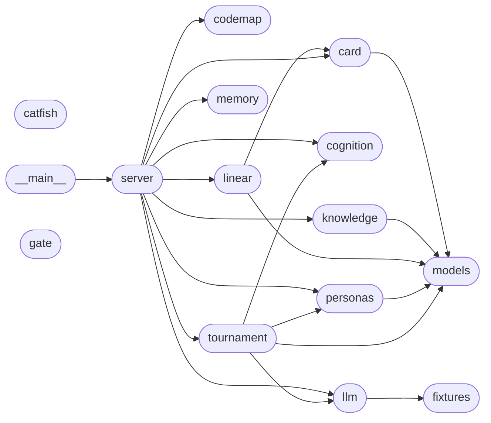

# Catfish — Codebase Map of Content

A **logic map** of the repo, organized by capability (what the code does), not file tree. Each node is a module-level capability; edges are `depends-on`. Open this folder in VS Code with the **Foam** extension for the interactive graph (the static graph below renders anywhere).

**Two layers:** this is the *engineer* dependency view. The *PM* business-capability view is in [[business]].

## Dependency graph

## Capabilities (by load-bearing rank)

- [[catfish-models]] — Shared data models for Catfish. _(used by 5)_
- [[catfish-card]] — Decision cards: build from a tournament result, enforce terseness, render, gate. _(used by 2)_
- [[catfish-cognition]] — The cognitive architecture, as plain markdown. _(used by 2)_
- [[catfish-llm]] — Inference layer. _(used by 2)_
- [[catfish-personas]] — Personas = reusable lenses. Each stamps a perspective-map: a filtered, typed view over the _(used by 2)_
- [[catfish-codemap]] — Logic-based Map of Content for a codebase, emitted as a Foam-compatible wiki. _(used by 1)_
- [[catfish-fixtures]] — Recorded demo fixtures — the AUTH-07 scenario. _(used by 1)_
- [[catfish-knowledge]] — Ingest -> normalized markdown -> Map of Content -> JSONL spine. _(used by 1)_
- [[catfish-linear]] — Gated Linear write-back: parent issue -> story children -> sub-issues, by recursive parentId. _(used by 1)_
- [[catfish-memory]] — Markdown session memory + handoff notes. _(used by 1)_
- [[catfish-server]] — CLI dispatcher + MCP server entry point. _(used by 1)_
- [[catfish-tournament]] — The tournament engine: generate -> reflect -> rank -> evolve -> meta-review. _(used by 1)_
- [[catfish]] — Catfish — stress-test plans in a tournament, decide in one card. _(used by 0)_
- [[catfish-__main__]] — catfish.__main__ _(used by 0)_
- [[catfish-gate]] — PreToolUse gate hook (Claude Code). _(used by 0) ⚙️ entry_

---
_Structure is extracted deterministically (stdlib `ast`). Business-value lines are **proposals**, not facts — confirm them. Catfish mapped itself with `catfish map src`._
